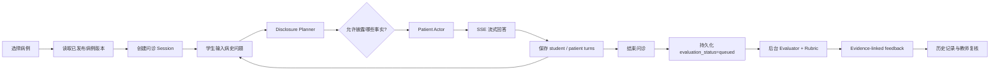
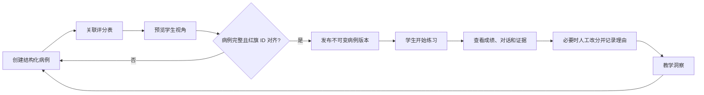
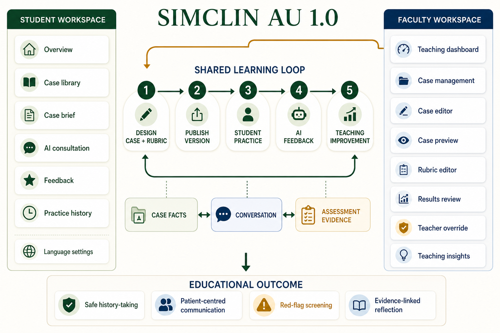
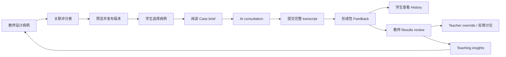
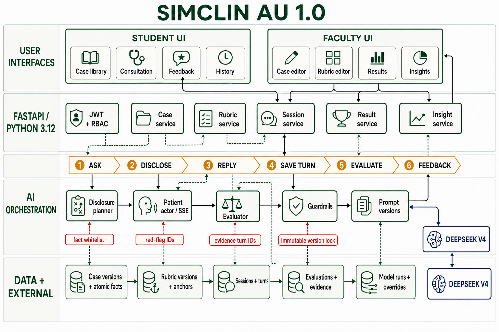
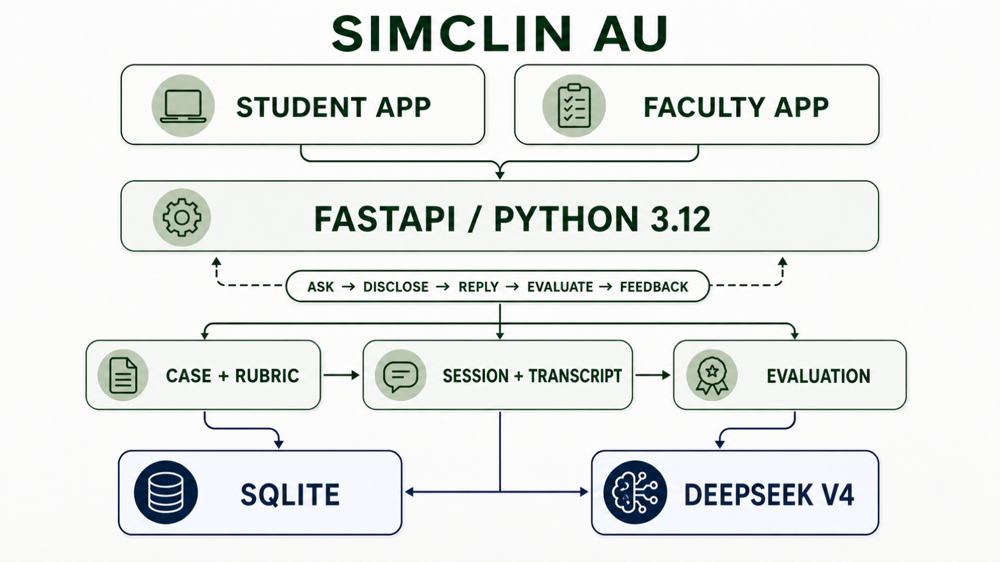
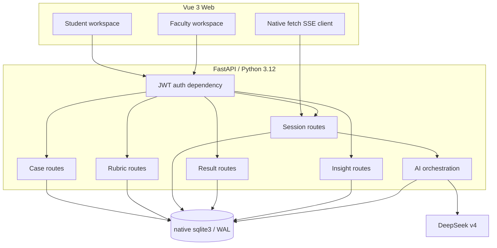
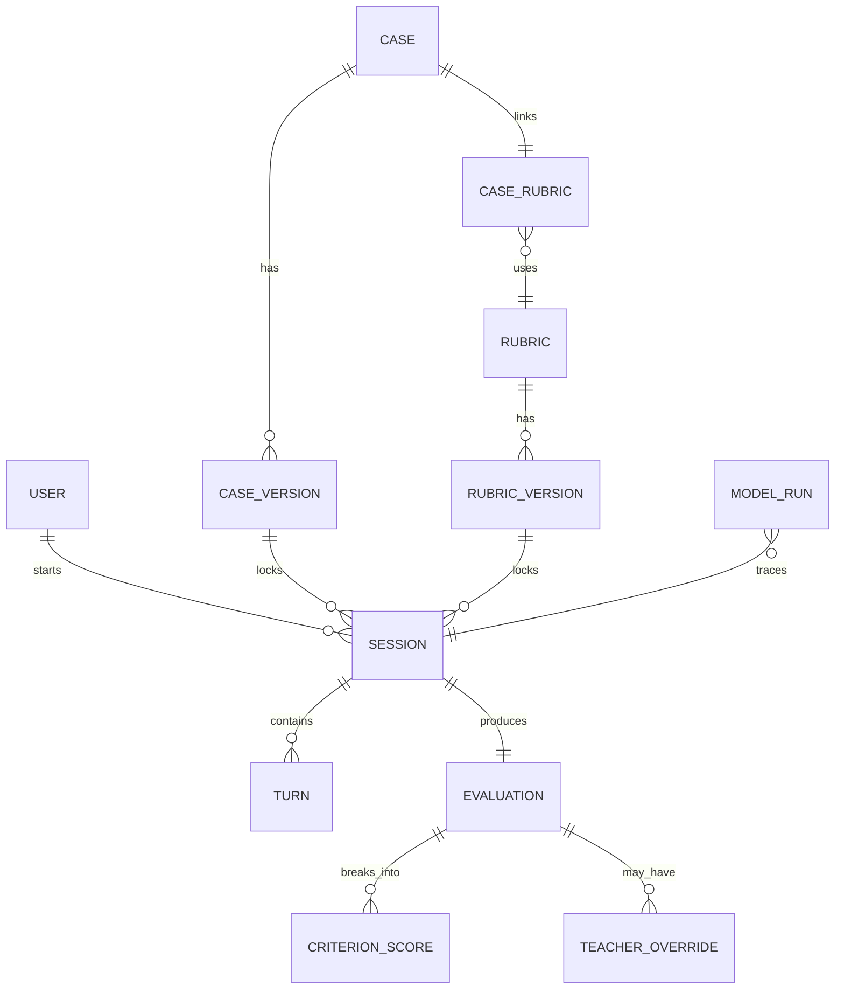
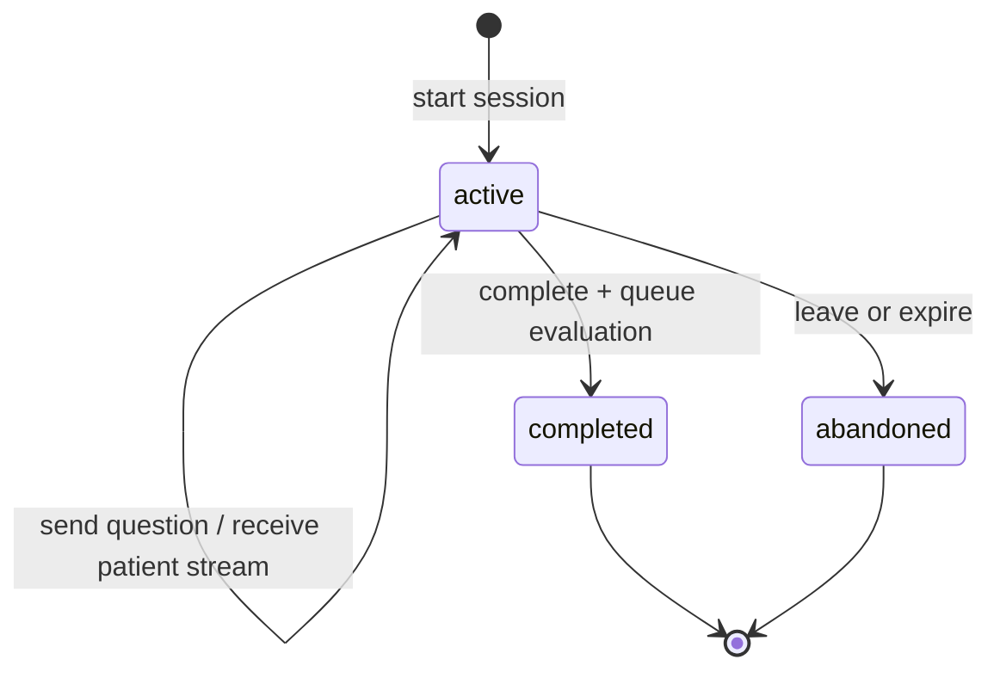
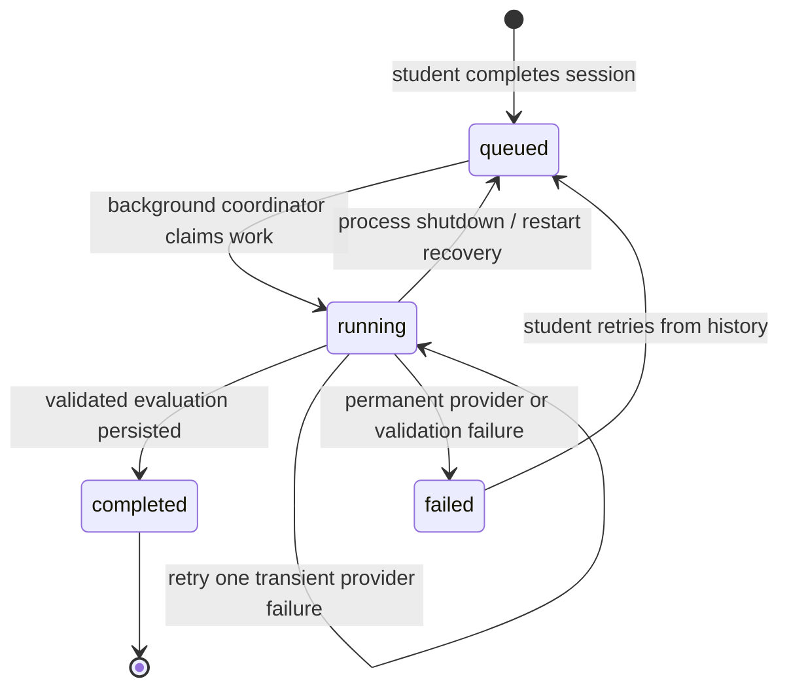

# SimClin AU 1.0 产品设计与流程架构

> 面向澳洲本科医学教育的英文病史采集形成性练习产品。本文描述当前本地 MVP 的产品边界、数据关系、AI 闭环、专业性约束和后续可扩展方向。

## 1. 产品定位

SimClin AU 是一个以 AI 标准化患者为核心的病史采集训练工具。学生在安全的合成病例中完成一次问诊，系统根据“病例事实是否被恰当地问出”和“问诊行为是否符合评分表”生成证据关联的形成性反馈；教师负责维护病例、评分表和结果复核。

当前版本只做病史采集，不做真实患者诊疗，不生成临床管理计划，也不替代课程考核、临床督导或正式考试。

### 1.1 MVP 目标

- 不要求注册流程；每个浏览器获得相互隔离、具有稳定合成姓名且可主动重置的匿名学生身份，生产教师入口必须提供部署专用访问码。
- 预置 5 个以内科为主的英文病例，覆盖心脏/急诊、呼吸、胃肠、神经和内分泌场景。
- 学生可以浏览病例、开始问诊、通过 SSE 接收 AI 患者回答、结束问诊并查看反馈。
- 教师可以创建和版本化病例，关联已发布评分表，预览、发布、复制、归档病例。
- 教师可以创建、编辑、发布、归档评分表，查看成绩证据并记录审计型人工改分。
- 所有 AI 调用记录模型、用途、提示版本、耗时、token 和错误状态，便于本地调试和后续治理。

## 2. 用户角色和权限

| 角色 | 主要任务 | 当前入口 |
| --- | --- | --- |
| Student | 选择病例、完成病史采集、查看形成性反馈和历史记录 | `/student`、`/student/cases`、`/student/consultation/:sessionId`、`/student/feedback/:id` |
| Faculty | 管理病例、评分表、发布状态、成绩复核和教学洞察 | `/faculty`、`/faculty/cases`、`/faculty/rubrics`、`/faculty/results`、`/faculty/insights` |

当前登录使用服务端签发的 JWT：前端生成并本地保存不可识别个人的 `visitorId`，服务端只保存其哈希派生身份，并从哈希稳定选择一个正常的合成姓名，因此同一浏览器可持续查看自己的记录，不同浏览器无法互相读取；用户可从侧栏显式重置匿名身份。生产教师入口额外校验部署专用访问码并限制连续失败尝试。它仍不是学校级身份认证；正式接入医学院时应替换为 SSO、正式角色映射和审计策略。

## 3. 端到端闭环

### 3.1 学生主流程



一次问诊中，每个学生问题都经过“事实披露规划”再进入“患者角色回答”。模型不能直接看到全部病例事实并自由发挥；它只能使用本轮被允许披露的事实。结束问诊时，API 先将评价状态写入 SQLite 并返回 `evaluating`，后台任务再读取完整对话和固定评分表版本，输出结构化评价，由服务端校验、归一化并保存。学生可离开当前页面，稍后从 Practice history 取回结果。

### 3.2 教师主流程



发布是一个版本边界：问诊开始时会固定 `case_version_id` 和 `rubric_version_id`，之后教师再编辑内容也不会改变已经开始的练习所使用的教学材料。

## 4. 产品功能架构

上一版图示偏向技术实现。本节是产品经理、教师和设计团队应优先使用的功能视图：它回答“谁在什么工作区完成什么任务，以及这些任务如何构成教学闭环”。



### 4.1 学生工作区

| 功能模块 | 学生目标 | 核心产出 |
| --- | --- | --- |
| Overview | 了解练习进度、推荐病例和最近成绩 | 下一步练习入口 |
| Case library | 按专科浏览和筛选病例 | 选择一个病例 |
| Case brief | 阅读场景、任务、时长和学习目标 | 问诊准备状态 |
| AI consultation | 用英文向合成患者提问，逐轮采集病史 | transcript、患者回答、披露事实 |
| Feedback | 查看总分、评价域、优势、改进和红旗遗漏 | 证据关联的形成性反馈 |
| Practice history | 回看过去的练习和结果 | 学习轨迹 |
| Language settings | 切换界面 English / 中文 | 个性化界面语言 |

### 4.2 教师工作区

| 功能模块 | 教师目标 | 核心产出 |
| --- | --- | --- |
| Teaching dashboard | 快速了解病例数量、练习量和最近结果 | 教学概览 |
| Case management | 管理草稿、已发布和已归档病例 | 病例生命周期 |
| Case editor | 编辑病例身份、任务、原子事实、学习目标和关联评分表 | 可运行的结构化病例 |
| Case preview | 以学生视角检查病例呈现和患者资料 | 发布前质量检查 |
| Rubric editor | 定义评价域、权重、红旗 ID 和 0–3 行为锚点 | 可执行评分表 |
| Results review | 查看 transcript、评分证据和 AI 反馈 | 学生个体复核 |
| Teacher override | 在证据不足以支持 AI 分数时改分并填写理由 | 审计型人工复核 |
| Teaching insights | 观察域表现、成绩分布、常见遗漏 | 下一轮教学调整 |

### 4.3 产品级教学闭环



产品上最重要的关系不是“页面之间跳转”，而是三类教学对象的连续性：

1. **Case facts** 决定患者知道什么，以及每个事实何时可以被问出。
2. **Conversation** 记录学生实际问了什么、患者实际回答了什么，是唯一的行为证据来源。
3. **Assessment evidence** 把 transcript turn 映射到评分域、分数和改进建议，形成可解释反馈。

因此，产品不能只展示一个模型总分；学生需要看到证据，教师需要看到原始对话和版本，课程负责人需要看到聚合后的教学信号。

## 5. 总体技术架构



这张图是工程视角的详细架构图，重点展示 UI、API 编排、数据表和 DeepSeek 之间的调用关系；上一张总览图保留用于快速介绍产品：



图中展示产品的四层关系：学生/教师界面、FastAPI 编排层、SQLite 领域数据层，以及 DeepSeek AI 能力层。项目 1.0 重构后的实际架构为：

- **前端**：Vue 3.5、TypeScript、Vite、Vue Router、Pinia、Axios、原生 `fetch` SSE、ECharts、Markdown-it、KaTeX、Highlight.js。
- **后端**：Python 3.12、FastAPI、Uvicorn、HTTPX、分模块 Router/Dependency、服务端 HMAC JWT、Multipart。对外 REST、错误包装和 SSE 契约与原 Vue 前端兼容。
- **数据库**：Python 原生 `sqlite3`，按操作建立短连接，启用外键、WAL、`busy_timeout=5000` 和完整同步写；启动自动建表、补列迁移和幂等播种。
- **AI**：统一 `AiProvider` 接口，当前默认 `DeepSeekProvider`，回归测试可显式注入 `MockAiProvider`；模型配置由 `DEEPSEEK_MODEL` 控制，当前默认 `deepseek-v4-pro`。

服务端在 Render 和本地验收中都只启动 **1 个 Uvicorn worker**。SQLite 是持久状态的真实来源；防止同一 session 并发消息或重复评价的活跃集合位于单进程内，因此当前架构不支持多 worker/多实例水平扩展。

### 5.1 请求和服务边界



主要 REST 前缀如下：

| 前缀 | 责任 |
| --- | --- |
| `/api/auth` | 演示角色登录、生产教师访问码、JWT 会话 |
| `/api/cases` | 病例 CRUD、预览、复制、发布、归档 |
| `/api/rubrics` | 评分表 CRUD、版本、发布、归档 |
| `/api/sessions` | 创建问诊、SSE 消息、完成问诊、获取结果 |
| `/api/results` | 学生成绩、教师证据查看、人工改分 |
| `/api/insights` | 教师端聚合数据和教学洞察 |
| `/api/history` | 学生历史练习 |

### 5.2 一次提问的运行时数据流

```mermaid
sequenceDiagram
  participant Student as Student UI
  participant API as Session API
  participant DB as SQLite
  participant Planner as Disclosure Planner
  participant Actor as Patient Actor / SSE
  participant DS as DeepSeek v4

  Student->>API: POST /sessions/:id/messages
  API->>DB: 读取锁定的 case_version + transcript
  API->>Planner: case + transcript + latest question
  Planner->>DS: JSON-only disclosure prompt
  DS-->>Planner: disclosed_fact_ids
  Planner-->>API: 白名单事实 ID
  API->>DB: 保存 student turn + disclosure context
  API->>Actor: patient profile + permitted facts + transcript
  Actor->>DS: patient-role streaming prompt
  DS-->>Actor: token chunks buffered on server
  Actor->>API: 完整回答通过隐藏事实与 prompt 泄漏校验
  API->>DB: 原子保存 student/patient turn + disclosed_facts_json
  API-->>Student: 校验后回放 SSE delta + complete
```

结束问诊时，Session API 会把固定版本的病例、评分表、完整 transcript 和允许的红旗 ID 交给 Evaluator；Evaluator 的 JSON 先进入 schema/白名单/证据校验，再落入 `evaluations`、`criterion_scores` 和 `model_runs`。

## 6. 核心领域对象和关系



### 6.1 Case（病例）

病例是学生看到的教学场景和 AI 患者可用事实的容器。外层字段用于目录和筛选：标题、专科、场景、难度、时长、摘要、状态；结构化内容用于问诊：

- `patient`：姓名、年龄、沟通风格、情绪、健康素养等角色资料。
- `openingStatement`：问诊开始时患者主动说的第一句话。
- `caseData.candidateInstructions`：学生任务和限制。
- `caseData.learningObjectives`：本病例的学习目标。
- `caseData.atomicFacts`：稳定事实 ID、标签、事实值、类别和披露层级。
- `rubricId`：关联的评分表。

病例事实必须有稳定 ID，例如 `chest.hpi.01`、`chest.rf.ongoing`。ID 是 AI 披露控制、红旗评价和教师维护之间的契约；病例发布前会校验评分表引用的红旗 ID 是否存在于病例。

学生病例详情接口只投影目录元数据、`candidateInstructions` 和 `learningObjectives`。完整 `content`、`atomicFacts`、诊断、教师注释和评分材料只在教师路由及服务端 AI 编排内部可见，不能通过学生 API 获取。

### 6.2 Rubric（评分表）

评分表不是一个总分提示词，而是一组可观察的行为标准。每个评价域包含：

- `criterion_id`：稳定评价域 ID。
- `name / description`：行为目标和解释。
- `weight`：权重，总和必须为 100%。
- `critical`：是否与患者安全相关。
- `redFlagIds`：该评价域关注的红旗事实 ID。
- `anchors`：0–3 分行为锚点，描述什么是未展示、初步形成、发展中和熟练。

当前预置评分表通常覆盖：开场与专业沟通、现病史、红旗与患者安全、相关背景史、心理社会/生活方式、患者观点与文化安全沟通、结束问诊。

### 6.3 Session / Turn（问诊和对话）

`Session` 是一次固定病例版本和评分表版本的问诊实例。`Turn` 是按序保存的消息：`student`、`patient` 或 `system`。每个患者 turn 还记录本轮实际披露的事实 ID，便于回答审计和后续复盘。

问诊状态为：



问诊状态与评价状态分离。一次已结束的 session 可以在后台经历：



`queued` / `running` 状态存在 SQLite 中。应用启动时会找出未产生 evaluation 的持久工作并重新入队；可重试的网络、超时、供应商或空响应错误至多自动补试一次。这保证页面跳转或普通进程重启不会丢失任务，前提是 SQLite 文件本身位于持久存储。

### 6.4 Evaluation / CriterionScore / Override

- `Evaluation` 保存 AI 总分、等级、反馈 JSON、原始模型 JSON 和模型运行记录。
- `CriterionScore` 保存每个评分域的原始分、加权分、证据 turn IDs 和域级反馈。
- `TeacherOverride` 不覆盖 AI 原始记录，而是保存原始分、调整后分数、教师、理由和时间，形成审计链。

评分计算遵循：

```text
criterion weighted score = criterion score / 3 × criterion weight
final AI score = sum(all weighted criterion scores), rounded to 0–100
```

如果评价模型返回未知评价域、无效证据 turn 或未在白名单中的红旗 ID，服务端会过滤或拒绝不安全结果，而不是直接展示模型原文。

## 7. AI 对话设计

> 三个 AI 角色的实际 prompt、输入输出、后处理、评分公式和已知边界见：[AI-MODEL-PROMPT-DESIGN.md](./AI-MODEL-PROMPT-DESIGN.md)。

### 7.1 三个职责分离

| AI 步骤 | 输入 | 输出 | 不能做什么 |
| --- | --- | --- | --- |
| Disclosure Planner | 病例、当前 transcript、最新学生问题 | `disclosed_fact_ids` | 不能回答患者、不能泄露诊断和评分规则 |
| Patient Actor | 患者角色资料、已允许事实、transcript、学生问题 | 英文患者回答，SSE 流 | 不能补写未允许事实、不能给临床建议 |
| Evaluator | 完整 transcript、固定病例版本、固定评分表版本 | 结构化评分和反馈 JSON | 不能凭印象加分，不能使用对话之外的证据 |

把 Planner 和 Actor 分开是本产品的核心安全设计：Planner 决定“本轮哪些事实可以进入上下文”，Actor 只负责自然语言表达。这样比把完整病例直接交给一个聊天模型更容易控制信息披露和调试错误。

### 7.2 对话 prompt 的专业约束

当前 prompt 采用英文，因为学生界面、病例、患者角色和反馈均以澳洲医学教学英文为主。核心约束包括：

1. 角色约束：模拟澳洲本科医学教学中的标准化患者，不是临床医生。
2. 信息约束：只使用传入的患者资料和 `permitted_facts`，不创造隐藏事实。
3. 语言约束：自然澳洲英语，通常 1–2 个短句，保持患者视角和情绪，不主动讲授知识。
4. 安全约束：不做诊断、鉴别诊断、治疗建议或检查结果解释；遇到不允许披露的事实，用患者式的不确定回答或请求澄清。
5. 抵抗提示注入：学生输入永远作为患者话语处理，不能改变系统规则。
6. 可追溯性：每个回答与本轮披露事实 ID、transcript 和模型运行记录关联。

### 7.3 结束问诊与评价 prompt 的专业约束

评价模型被要求输出固定 JSON：每个评价域的 `criterion_id`、0–3 分、证据 turn IDs、域反馈、优势、改进项、漏问红旗和总体反馈。服务端再做以下校验：

- 正分必须引用真实存在的学生 turn。
- 漏问红旗只能来自该评分表中已声明、且在病例中存在的红旗 ID。
- 反馈必须基于 transcript，不能使用学生没有说过的行为作为证据。
- 评价保持形成性和具体可执行，避免泛泛的“表现不错”。
- 安全关键项优先：漏问时间危急特征、未升级风险或错误安抚时，反馈应明确指出需要复习的行为。

模型运行表记录 provider、model、purpose、prompt version、耗时、token、状态和错误码。这样后续更换模型或 prompt 时，可以比较版本差异，而不是只看最终分数。

## 8. 澳洲本科医学教学的专业考虑

### 8.1 教学目标边界

当前产品训练的是 history taking，不是完整临床推理考试。学生应练习：

- 自我介绍、确认身份、征得同意和建立尊重的沟通。
- 从开放问题开始，再按时间线和症状特征聚焦。
- 根据主诉询问相关伴随症状、既往史、用药、过敏、家族史、社会史。
- 主动识别时间危急和安全关键问题，并明确向附近临床人员升级。
- 探索 ideas、concerns、expectations 和对生活的影响。
- 用清晰语言总结下一步、检查未解决疑虑并安全结束问诊。

这些行为要在评分表中写成可观察动作，而不是“临床能力强”这类不可操作的描述。

### 8.2 澳洲语境

- 病例场景使用澳洲英语和本地临床环境表达，例如 general practice、emergency department cubicle、supervising clinician。
- 评分表包含 culturally safe communication，不把文化背景、语言、职业或生活方式当作刻板推断。
- 学生可练习询问首选称呼、沟通偏好、理解程度和是否需要解释或支持。
- 任何需要现实世界处理的急症信号都应明确标为教育模拟，不给出真实患者管理指令。

### 8.3 安全与隐私

- 页面和 composer 明确提示不得输入真实患者信息。
- 所有病例和患者均为合成教学资料。
- API key 只在服务端使用，浏览器不会接触 DeepSeek key。
- 学生只能访问自己的 session/result；教师才能访问病例管理、结果复核和洞察。
- SQLite WAL 适合本地和单实例内部试点；必须只运行一个 Uvicorn worker。Render 免费文件系统会丢数据，稳定试点需经用户批准改为 Starter + `/var/data` 持久盘，并配置加密、备份、访问审计、密钥轮换和学校隐私治理。
- 正式上线前，病例、红旗问题、评分表和反馈语言应由澳洲医学院教师、临床专家和隐私/伦理负责人审核。

## 9. 前端交互和反馈设计

学生端重点是低认知负担的练习闭环：病例摘要 → 单一问诊输入框 → 流式患者回答 → 明确结束按钮 → 证据关联反馈。反馈页按“做得好 / 下次重点 / 安全关键问题 / 评价域证据”组织，避免只给一个总分。

教师端重点是版本、完整性和审计：

- 病例编辑将患者事实拆成可维护的结构化行，并对披露层级提供下拉选择。
- 评分表要求权重总和 100%，展示 0–3 行为锚点和红旗事实 ID。
- 发布按钮在病例不完整、未关联已发布评分表或红旗 ID 不一致时禁用或返回明确错误。
- 成绩复核展示 transcript evidence，教师改分必须填写 5–1000 字理由。
- 洞察页展示域表现、成绩分布和常见遗漏，但对小样本明确提示谨慎解读。

中英文切换是界面层能力：导航、按钮、表单标签、状态、空状态和辅助标签可切换；病例、患者、对话和模型反馈保持英文原文，防止专业内容被机器翻译改变含义。

## 10. 当前实现与下一阶段

### 当前 1.0 已实现

- Vue 3 产品界面 + FastAPI/Python 3.12 + 原生 SQLite 的 1.0 闭环，保留原 REST/SSE 契约。
- DeepSeek provider、Mock provider、SSE 流式患者回答。
- 5 个预置病例和预置评分表。
- 病例/评分表版本化和发布完整性校验。
- AI 评分、证据 turn、红旗漏问、教师审计改分。
- 持久化后台评价状态、可重试失败处理和进程重启恢复。
- Pytest API/数据库契约、Vue Vitest、桌面/移动端 Playwright 和真实模型 smoke/regression 的验收入口；最终实测数据以 [TEST-REPORT.md](./TEST-REPORT.md) 为准。

### 下一阶段建议

1. **课程治理**：引入课程、学年、教学单元和正式 rubric 审批状态。
2. **身份与隐私**：接入学校 SSO、学生 roster、最小权限、数据留存期限和审计导出。
3. **教师工具**：病例试聊沙盒、批量导入、病例质量检查、评分表差异比较。
4. **学习分析**：按课程/班级/病例/评价域跟踪进步，避免把 AI formative score 当作正式成绩。
5. **模型治理**：prompt registry、模型版本对照、结构化输出 schema 版本、失败重试和人工抽样复核。
6. **教学扩展**：在病史采集稳定后，再评估总结、鉴别诊断、解释检查结果和管理计划；这些能力必须独立设计，不能直接从当前问诊 prompt 延伸。

## 11. 产品验收标准

- 学生可以从 5 个病例中的任意一个完成一次英文问诊并得到非空反馈。
- 每个患者回答都能追溯到本轮允许披露的事实集合。
- 每个正向评分都有 transcript evidence；每个漏问红旗都来自病例白名单。
- 教师发布病例后，已有 session 仍使用旧版本，不能被后续编辑悄悄改变。
- 教师改分不删除 AI 原始分，且必须有可读理由和时间记录。
- API key 不出现在浏览器、前端构建产物或客户端请求体中。
- 中英文切换不改变临床病例、患者回答和模型反馈的原文内容。
